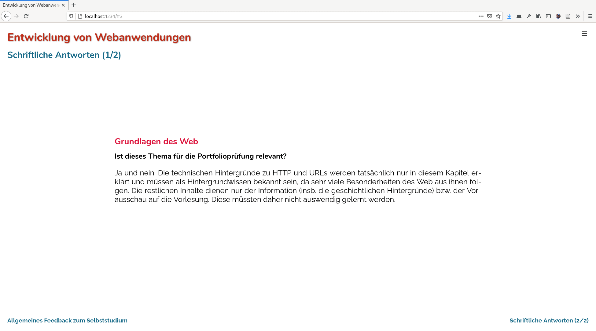

mini-tutorial.js template project
=================================

Getting Started
---------------

This is the recommended project structure for a `mini-tutorial.js` document.
Simply download this repository and start hacking it. It couldn't be easier. :-)

 * Download this repository (__Clone or download » Download ZIP__)
 * Extract anywhere on your computer
 * Install needed packages
 * Hack away

Use the following commands while working on a document:

 * `npm install` to install all dependencies
 * `npm run start` to open a browser for a live preview
 * `npm run build` to build a static version for uploading on a webserver
 * `npm run watch` to rebuild after each change without starting a local server
 * `npm run clean` to just clean the dist directory

The project may contain as many documents as you like. Each one of them is
just a HTML file in the `src` directory. See `src/index.html` for an example.

Screenshot
----------

And here comes the obligatory screenshot. This is just a simple layout for a
slideshow persentation.

Other templates
---------------

 * [mt-template-simple](https://www.github.com/DennisSchulmeister/mt-template-simple) (this one)
 * [mt-template-roundbox](https://www.github.com/DennisSchulmeister/mt-template-roundbox)
 * [mt-template-book](https://www.github.com/DennisSchulmeister/mt-template-book)

Copyright
---------

`mini-tutorial.js` uses the Affero GPL 3. This example however uses a
3-clause BSD license, because you may not want to use the GPL on your documents.
:-) Well if you do, hat off to you, but of course you don't have to.

mini-tutorial.js (https://www.github.com/DennisSchulmeister/mini-tutorial.js)  
This template: (https://www.github.com/DennisSchulmeister/mt-template-simple)  
© 2020 Dennis Schulmeister-Zimolong <dennis@pingu-mail.de>
